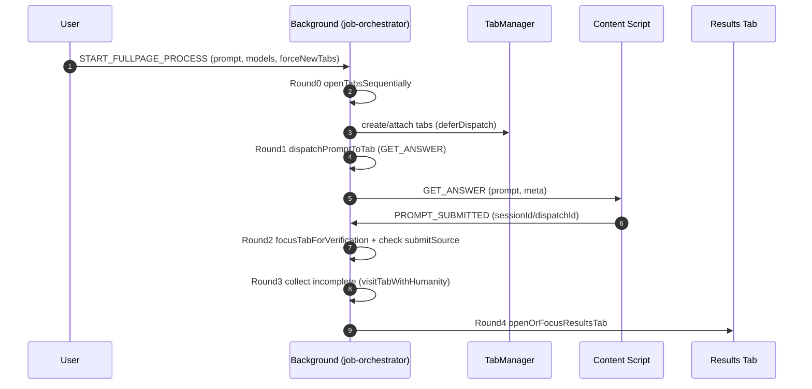

План стабилизации сессий/таймеров/фокуса (LLM_Codex)

Версия: 2.71.47
Дата: 2026-01-29 23:25

Обновление v2.71.47 (2026-01-29 23:25)
- Round1 теперь дожидается полного dispatch-пайплайна, а его длительность учитывает 3s defer + 10s post-send (с компенсацией elapsed).
- При `ACK_READY` timeout добавлен recovery (reinject/reload) и повторная проверка готовности до ретрая.
- Round2 при `ensureTabReadyForDispatch` теперь делает fallback на повторное разрешение tabId и пишет `ROUND2_SKIP` при пропуске.
- Документация раундов синхронизирована с фактическим поведением и пост‑Round3 human‑presence визитами.

 0. Контекст и выводы из переписки (для правильного приоритета)
0.1. Источник истины по сессии уже хранится в `jobState.session.startTime` и сохраняется в storage — это защищает от перезапуска SW, но не отменяет хвосты таймеров.
0.2. `TabMapManager` — реально async (mutex + storage), отсутствие `await` даёт гонки.
0.3. `messageSent` не является строгим подтверждением UI‑submit (есть API/inferred пути).
0.4. Троттлинг — симптом; корни в stale callbacks, двойных источниках и невалидных focus‑триггерах.
0.5. Любая защита должна быть “session‑bound”: любое отложенное действие обязано сверять сессию.

---

## Схема раундов (таблица)

| Round | Назначение | Основные действия | Риски/заметки |
| --- | --- | --- | --- |
| Round 0 | Открытие/подготовка вкладок | `openTabsSequentially` → `startModelForLLM(..., deferDispatch: true)` | Задержка между вкладками `ROUND0_OPEN_STAGGER_MS` (в коде сейчас 1000ms) |
| Round 1 | Отправка промпта | `dispatchPromptToTab(... 'round1')` → `GET_ANSWER` | Включает deferSend + ожидание подтверждения; общий бюджет 3s + 10s |
| Round 2 | Верификация отправки | `focusTabForVerification` + проверка `promptSubmittedAt` | Проверка не DOM, а факт `PROMPT_SUBMITTED`; если tab not ready → `ROUND2_SKIP` |
| Round 3 | Сбор ответов | `dispatchRound3CollectAnswers` → `visitTabWithHumanity` | Только по незавершённым моделям; после Round3 возможны дополнительные `TAB_VISIT` от human‑presence loop |
| Round 4 | Возврат фокуса | `openOrFocusResultsTab` | Завершение цикла |

## Mermaid sequence diagram (Rounds)

---

 1. Граница сессии и отменяемые ожидания (Session Boundary)
Цель: не допускать выполнения старых таймеров/ожиданий после stop/start.

1.1. Abort‑контроллер для оркестратора
- Для чего: остановка долгих ожиданий (sleep) при `stopAllProcesses()`.
- 100% - `orchestratorAbortController`, reset при новом job и abort при stop.

1.2. Cancellable `orchestratorSleepMs`
- Для чего: sleep должен завершаться при abort.
- 100% - `orchestratorSleepMs` завершает промис при abort.

1.3. Глобальный реестр таймеров сессии
- Для чего: иметь единое место управления всеми `setTimeout`/`setInterval`.
- 100% - `registerSessionTimer`/`deregisterSessionTimer`/`clearSessionTimers`.

1.4. Очистка реестра в `stopAllProcesses()`
- Для чего: гарантированное гашение всех таймеров на stop.
- 100%

1.5. Привязка таймеров в job‑orchestrator
- Для чего: Round‑таймеры, recovery‑чек, staged‑collect не должны «стрелять» после stop.
- 100% - recovery/collect/sleep подключены к реестру.

1.6. Привязка таймеров в dispatch‑coordinator
- Для чего: supervisor/retry/timeout/focus‑restore должны быть session‑bound.
- 100% - все `setTimeout` в модуле зарегистрированы.

1.7. Привязка таймеров в message‑router
- Для чего: ранние readiness и smoke‑check не должны зависать после stop.
- 100%

1.8. Привязка таймеров в health‑monitor
- Для чего: health‑check, heartbeat, reinject timeout не должны жить после stop.
- 100%

1.9. Инструментировать `clearSessionTimers`
- Для чего: фиксировать, сколько и какие сессионные таймеры остаются к моменту `stopAllProcesses()`, чтобы сразу заметить забытые регистрации.
- 100% - `clearSessionTimers()` теперь печатает warning с количеством таймеров и фрагментами стека из `sessionTimerMetadata`, после чего очищает и реестр, и сопутствующую мета‑информацию.

---

 2. Единый источник tabId (Single Source of Truth)
Цель: исключить рассинхрон tabId между `TabMapManager` и `jobState`.

2.1. Убрать прямые записи tabId вне TabMapManager
- Для чего: исключить «двойной источник».
- 100% - прямое присваивание удалено, используются binding‑методы.

2.2. `await`/`catch` для TabMapManager в критичных местах
- Для чего: исключить гонки записи/очистки.
- 100% - job‑orchestrator/message‑router/evaluation‑manager.

2.3. Убрать fallback на `entry.tabId` в `getBoundTabId` или ограничить его
- Для чего: не возвращать устаревшие tabId из jobState.
- 100% - fallback разрешён только один раз: `getBoundTabId` вызывает `markFallbackBinding`, который копирует `entry.tabId` в `TabMapManager`, сбрасывает `entry.tabId` и блокирует повторные recovery через `fallbackRecoveryUsed`, а `clear()` очищает этот флаг. Таким образом TabMap остаётся единственным источником, но мы не теряем реэнтри опций после перезапуска SW.

---

 3. Фокус и видимость (Focus Protocol)
Цель: фокус переключается только для актуальной сессии и только при реально активном запросе.

3.1. `NEED_FOCUS` с полной валидацией
- Для чего: запретить фокус на старые вкладки.
- 100% - проверка sessionId, llmName, tabId, status.

3.2. Передача sessionId в content‑скрипты
- Для чего: чтобы `NEED_FOCUS` мог быть валиден.
- 100% - bootstrap ловит sessionId из сообщений.

3.3. `requestFocusFromBackground` в ContentUtils
- Для чего: единая точка запроса фокуса, throttling.
- 100% - добавлено с throttle.

3.4. Ограничить focus‑запрос только при активном GET_ANSWER
- Для чего: убрать лишние фокус‑срабатывания при idle.
- 100% - `ContentUtils.requestFocusFromBackground` теперь проверяет `hasActiveRequest()` и `startActiveRequest`/`stopActiveRequest` вызываются исключительно вокруг `GET_ANSWER/GET_FINAL_ANSWER` в каждом адаптере, так что focus запрашивается только если запрос ещё не завершён.

3.5. Убедиться, что нет конкурирующих visibility‑handlers в адаптерах
- Для чего: не дублировать `NEED_FOCUS` сигнал.
- 100% - аудит всех content-адаптеров подтвердил, что `requestFocusFromBackground` вызывается только из `content-utils`, а собственные `visibilitychange` обработчики больше не пытаются переключать фокус.

3.6. (Опционально) Обработка `SESSION_EXPIRED` в адаптерах
- Для чего: мягко выключать старый контент без лишних фокус-триггеров.
- 100% - `content-scripts/content-utils.js` перехватывает `SESSION_EXPIRED` от background, вызывает `humanSessionController.forceHardStop`, сбрасывает активные запросы и ставит `__SESSION_EXPIRED__`, чтобы старые вкладки не перезапрашивали фокус.

---

 4. Протокол сообщений и подтверждений
Цель: корректная трактовка “sent/submitted” в разных потоках.

4.1. Явно различить источники dispatch (web/api/inferred)
- Для чего: не считать `messageSent` подтверждением UI‑submit везде.
- 100% - добавлены `dispatchSource`/`submitSource`, Round2 проверяет только подтверждение от content.

4.2. Гарантировать, что `PROMPT_SUBMITTED` всегда несёт sessionId
- Для чего: фильтровать stale‑коллбеки по session boundary.
- 100% - `ContentUtils.ensureDispatchMeta` гарантирует `sessionId`, background нормализует мета.

---

 5. Навигационные/контекстные guards
Цель: контент‑скрипты не работают на «отцепившемся» DOM.

5.1. SPA Navigation Guard
- Для чего: фиксировать client‑side навигацию, вызывать cleanup/reinit.
- 100% - SPA‑событие ловится в `ContentUtils`, запускается cleanup по LLM.

5.2. Extension Context Guard
- Для чего: корректно переживать reload extension контекста.
- 100% - invalidation вызывает cleanup для активного LLM‑контента.

---

 6. Валидация/тесты и операционная дисциплина
Цель: подтвердить, что изменения реально работают в живом режиме.

6.1. Stop→Start стресс‑тест
- Для чего: убедиться, что нет “хвостов” таймеров и stray focus.
- 0% - нужен ручной прогон с логами `[HEALTH-CHECK]`/`[DISPATCH]`.

6.2. Сценарий “старая вкладка просит фокус”
- Для чего: проверить `NEED_FOCUS` блокировку.
- 0%

6.3. Документация user‑facing релиза
- Для чего: прозрачность изменений для команды/пользователя.
- 100% - в `docs/change-log-codex.md` появились записи для v2.71.35 (16:58), v2.71.36 (17:10), v2.71.37 (17:30) и v2.71.38 (23:49) с описанием focus-guards, таймеров, `SESSION_EXPIRED`, ограниченного fallback и dispatch/meta/SPA guard.

---

 7. Версионирование и отчётность
Цель: каждая волна изменений должна быть отражена в version + changelog.

7.1. Обновление версии в manifest
- Для чего: явная фиксация релиза.
- 100% - текущая версия 2.71.38 (dispatch/meta guards + SPA/Context cleanup).

7.2. Change‑log с “Для чего/Изменение/Файлы”
- Для чего: история релизов, быстрый аудит.
- 100% - записи за 2026‑01‑26 16:58, 17:10, 17:30 и 23:49 с описанием dispatch/meta/SPA guard изменений.

---

 Итоговая сводка (процент выполнения по разделам)
- Раздел 1 (Session Boundary): 100% (логирование `clearSessionTimers` добавлено, реестр пуст после `stopAllProcesses()`).
- Раздел 2 (TabId Single Source): 100% (fallback `entry.tabId` ограничен одноразовым recovery).
- Раздел 3 (Focus Protocol): 100% (3.4/3.6 закрыты; фокус только для активных GET_ANSWER, а stale вкладки self-expire).
- Раздел 4 (Протокол сообщений): 100% (dispatch/meta разделены, PROMPT_SUBMITTED с sessionId).
- Раздел 5 (Guards): 100% (SPA/Context cleanup унифицирован).
- Раздел 6 (Валидация/документация): 33% (осталось 6.1 stop→start стресс и 6.2 “старая вкладка просит фокус”).
- Раздел 7 (Версии/лог): 100%.

---

 Что критично закрывать дальше (минимальный прод‑набор)
1) 6.1 — быстрый ручной тест stop→start с логами `[HEALTH-CHECK]`/`[DISPATCH]`, чтобы убедиться, что после restart не остаётся stray-фокусов или таймеров.
2) 6.2 — смоделировать старую вкладку, которая шлёт `NEED_FOCUS`, и убедиться, что сообщение игнорируется и не возобновляет фокус.
